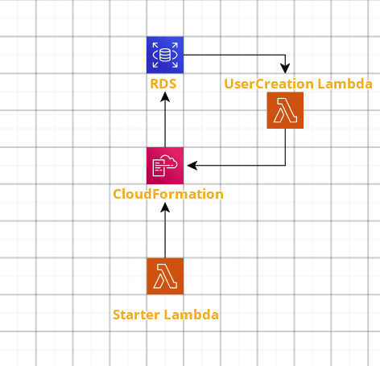

# AWS Lambda as Custom Resources in AWS CloudFormation (Java, Lambda, RDS)

Custom Resources are a way to call resources that are not directly supported by CloudFormation template.
Here in this post, I would like to share my experience with using AWS Lambda, CloudFormation, RelationalDatabase Service(AWS RDS) with Java as the language. The main purpose of this post is to help people who are trying to setup AWS Lambda as Custom Resource in CloudFormation. Make sure you experiment this under AWS free tier and delete the resources after you use it. Else you would be charged for the resource usage.

**Build :**

1) `mvn clean install`
2) Upload this jar to your lambda through web console or command line. You can upload this same jar for both starter lambda and user creation lambda.
3) For starter lambda, choose Runtime as Java 8 and 'CloudFormationStarter::handleRequest' as Handler 
4) For UserCreation lambda, choose Runtime as Java 8 and 'CloudFormationCallBack::handleRequest' as Handler
5) Run the starter lambda with empty json as input data.
6) Make sure you delete CloudFormation and verify if that deleted RDS as you will be billed for resources.

Make sure you experiment this under AWS free tier and delete the resources after you use it. Else you would be charged for the resource usage.

Medium post link : https://medium.com/@epraveenns/aws-lambda-as-custom-resources-in-aws-cloudformation-java-lambda-rds-ed31287ee0ce 
